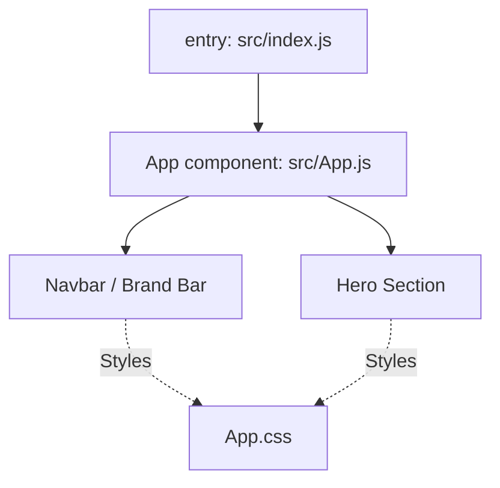

# EasyCalc Project: Architectural Overview & Documentation

## Project Introduction

**EasyCalc** is a lightweight React-based frontend application, designed as a template for rapid UI development with modern aesthetics and minimal dependencies. The application demonstrates a clean structure, modular UI components, and a flexible design system, making it an ideal starting point for simple web applications or as a foundation for more complex frontend projects.

---

## Technology Stack

- **Frontend Framework**: [React JS](https://react.dev/) (v18)
- **Language**: JavaScript (ES6+)
- **Styling**: Vanilla CSS with CSS custom properties (variables) for theming and brand colors, defined in `src/App.css`
- **Build/Tooling**: [react-scripts](https://www.npmjs.com/package/react-scripts) (as part of Create React App)
- **Linting**: ESLint (configured with React plugins)
- **Testing**: Jest & React Testing Library (custom matchers imported via setup)

---

## Features

- **Minimalist UI**: No heavy UI frameworks, focusing on performance and custom design.
- **Modern Design**: Responsive layout, clear typography, and accessible color theme.
- **Quick Start**: Easily run in development, build for production, and run tests with standard npm scripts.
- **Brand Customization**: KAVIA brand colors are implemented using CSS variables for easy theme changes.
- **Component-Centric**: Code is organized by reusable components (though currently only the base app structure and template are present).
- **Ready for Expansion**: The architecture supports rapid feature addition and theming.

---

## Application Architecture

### High-Level Structure

**Directory Layout:**
- `easycalc_frontend/src/index.js`: Entry point; renders the root React component (`App`) into the DOM.
- `easycalc_frontend/src/App.js`: Main application component; defines structure and UI for the homepage.
- `easycalc_frontend/src/App.css`: Defines all visual styles, layout, and theming.
- `easycalc_frontend/src/index.css`: Applies global resets and font styling.
- `easycalc_frontend/src/setupTests.js`: Configures Jest for more expressive DOM testing.

### Key UI Components

- **Navbar**: Fixed navigation bar at the top, includes app branding (KAVIA AI) and an action button.
- **Hero Section**: Central section with main title, subtitle, description, and a call-to-action button.
- **Container**: Centers and constrains app content for optimized readability on all device sizes.

### Theming & Styles

- Main brand and theme colors are set via CSS variables in `App.css`:
  - `--kavia-orange` (accent color)
  - `--kavia-dark` (background)
  - `--text-color` and secondary variants
- Components use semantic class names (e.g., `.navbar`, `.btn`, `.container`).

---

## Major Component Relationships

- `index.js` → Bootstraps the application by rendering `App`.
- `App.js` → Composes UI using semantic sectioning: Navbar and main content sections.
- App-specific styling is encapsulated in `App.css`, while `index.css` covers basic resets and font smoothing.

---

## Dev & Build Workflow

**Available npm scripts (from `package.json`):**
- `npm start` — Launches development server (hot reloading enabled).
- `npm test` — Runs the test suite.
- `npm run build` — Builds production assets in the `build` directory.
- `npm run eject` — Allows direct customization of build config (advanced use only).

**Linting**:
- ESLint is configured with recommended React rules.
- Custom lint rules allow flexibility for frequently used global variables (`document`, `window`).

**Testing**:
- Custom Jest matchers are enabled via `@testing-library/jest-dom` for expressive front-end tests.

---

## Current Features & Planned Expansion

This template serves as the core for EasyCalc, a simple calculator app to be expanded with UI and logic for:
- Addition
- Subtraction
- Multiplication
- Division
- Clear/Reset

These features will be implemented by extending the current React structure, adding new UI components (e.g., digit/operation buttons, result display) and related state management.

---

## Summary

EasyCalc (current state) exemplifies a robust starting point for React applications—prioritizing clarity, theming, and maintainability. Its architecture is intentionally simple but immediately adaptable for a range of web-based UI projects.

---

## References

- [easycalc_frontend/README.md](../easycalc_frontend/README.md)
- [easycalc_frontend/package.json](../easycalc_frontend/package.json)
- [easycalc_frontend/src/App.js](../easycalc_frontend/src/App.js)
- [easycalc_frontend/src/App.css](../easycalc_frontend/src/App.css)
- [easycalc_frontend/src/index.js](../easycalc_frontend/src/index.js)
